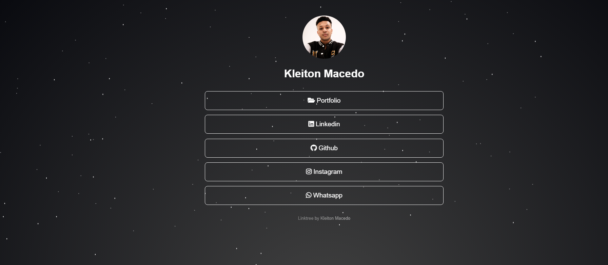

# 🌲 Linktree

Site simples para reunir todos os meus perfis e contatos em um só lugar.



## 💡 Sobre o projeto

Este projeto é uma alternativa gratuita ao site Linktree, totalmente personalizável.

- [Site no Ar](https://kleiton-linktree.vercel.app//)

## 🚀 Como usar

1. Clone ou baixe o projeto para sua máquina:
```bash
git clone https://github.com/kleitonmac/linktree-pages.git
```
2. Abra a pasta do projeto no [Visual Studio Code](https://code.visualstudio.com/).
3. Para visualizar, utilize a extensão [Live Server](https://marketplace.visualstudio.com/items?itemName=ritwickdey.LiveServer) ou abra o arquivo `index.html` diretamente no navegador.
4. Personalize sua foto de perfil trocando o arquivo `pfp.png`.
5. Edite seus links, textos e ícones no arquivo `index.html`.
6. Altere cores, fontes e estilos no arquivo `style.css`.

## ✨ Personalização
- Para mudar a imagem de fundo, edite o arquivo `style.css`.
- Para adicionar ou remover links, edite o bloco `<div id="links">` no `index.html`.
- Ícone do site pode ser alterado pelo arquivo `DS_ico.ico`.

---

-Kleiton Macedo
