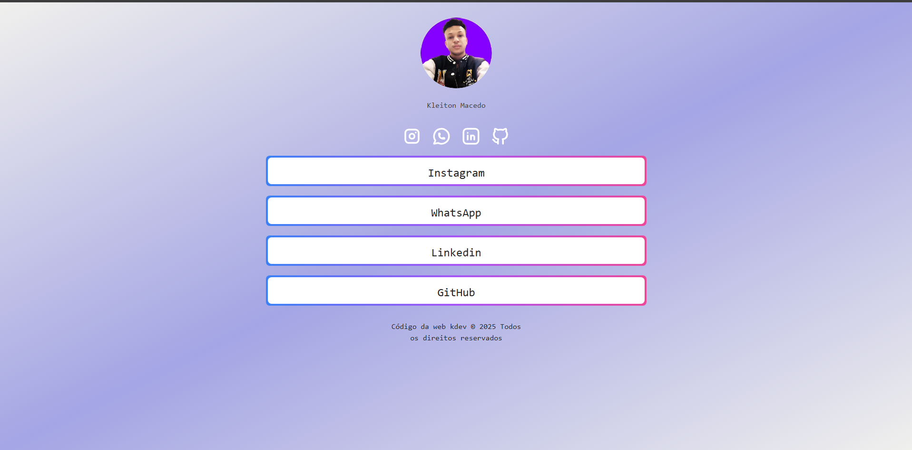

Getting Started
<<<<<<< HEAD

<<<<<<< HEAD

=======

>>>>>>> 1eab529 (Pages)
1. Acesse a pasta do projeto
bash
Copiar
Editar
cd linktree-pages
<<<<<<< HEAD

=======
=======

>>>>>>> 1eab529 (Pages)
1. Acesse a pasta do projeto
bash
Copiar
Editar
cd linktree-pages
<<<<<<< HEAD

>>>>>>> 656e507d3ee24d5cbf42788169004a1a1dd32ebf
3. Instale as dependências
=======
2. Instale as dependências
<<<<<<< HEAD
>>>>>>> 1eab529 (Pages)
=======

>>>>>>> e924e20 (Pages)
bash
Copiar
Editar
npm install
# ou
yarn install
# ou
pnpm install
# ou
bun install
<<<<<<< HEAD
<<<<<<< HEAD

=======
>>>>>>> 1eab529 (Pages)
=======

>>>>>>> e924e20 (Pages)
3. Inicie o servidor de desenvolvimento
bash
Copiar
Editar
npm run dev
# ou
yarn dev
# ou
pnpm dev
# ou
bun dev
Abra http://localhost:3000 no seu navegador para ver o resultado.

Você pode começar a editar a página modificando o arquivo app/page.tsx. A página será atualizada automaticamente à medida que você salva.

Este projeto usa next/font para otimizar e carregar automaticamente a fonte Geist, uma nova família tipográfica da Vercel.

Learn More
Para saber mais sobre o Next.js, confira os seguintes recursos:

Documentação do Next.js – aprenda sobre os recursos e a API.

Learn Next.js – um tutorial interativo oficial.

<<<<<<< HEAD
Você também pode conferir o repositório oficial do Next.js no GitHub – sugestões e contribuições são bem-vindas!
=======
Você também pode conferir o repositório oficial do Next.js no GitHub – sugestões e contribuições são bem-vindas!
>>>>>>> 1eab529 (Pages)
